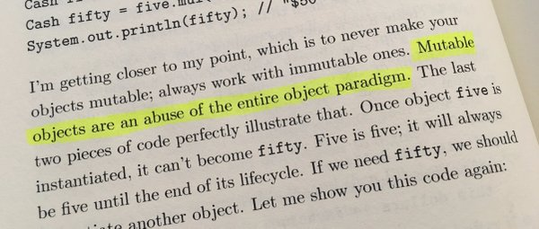

# persistent-clazz
A collection of utilities for making lightweight persistent objects (and hierarchies of such) in JS.

This library facilitates a specific style of OOP which favours composition over inheritance and immutable over mutable.



##Motivation/About

Making a user friendly persistent API is tricky, especially when dealing with nested structures. You have to explicitly construct a new object on each change. You cannot just call a method of an object you reference - you have to update the reference with the new version.

However fluent persistent API's are also a real pleasure to use and they work as a very nice alternative to functional composition. JavaScript already has facilities for creating immmutable datastructures - the `Object.freeze` method so all it takes to finish up the job is to define a couple of very simple helpers.

##Example

The following example defines two types, `Point` and `Circle`, where both of them are persistent.

```javascript
const {clazz, getter, setter, alias, lens, assign} = require('../src/main')

const number = (val) => {
  if (typeof val === 'number') {
    return val
  } else {
    throw new Error(val + ' is not a number')
  }
}

//Define a class-like object using the 'clazz' helper (or with any other)
const Point = clazz({
  //Define constructors
  constructor(x, y) {
    return {x,y}
  },
  toString(){
    return `(${this.x}, ${this.y})`
  },
  // Easily define getters and immutable setters with support for validation:
  setX:setter('x', number),
  setY:setter('y', number),
  getX:getter('x'),
  getY:getter('y'),
})

exports.getterSetter = (test) => {

  // Create the object as you normally would.
  point = Point(1, 2)

  // Apply transformations to an object to get a new one
  newPoint = point
              .setX(2)
              .setY(3) 

  // The reference to the new object is updated
  test.equal(newPoint.toString(), '(2, 3)')

  // Old value remains unchanged
  test.equal(point.toString(), '(1, 2)' )

  // Validation also works
  test.throws(()=> { point.setX('a')} )

  test.done()
}


const Circle = clazz({

  //Use the objects that you have to build new ones.
  constructor (x, y, radius) {
    const center = Point(x, y)
    return { center, radius }
  },

  //Create lenses for accessing properties of member objects
  printCenter: alias('center', 'toString'),
  
  // Create lenses for modifying properties of member objects.
  setX:lens('center', 'setX'),
  setY:lens('center', 'setY'),

  // Use the low level 'assign' function to define custom modification methods without also defining explicit setters
  changeSize (amount) {
    return assign(this, {radius: this.radius + amount})
  }
})

exports.hierarchies = (test) => {
  const circle = Circle(0, 0, 1)
  // And use methods for both the host and member objects.
  biggerCircle = circle
                  .changeSize(1)
                  .setX(10)
                  .setY(10)

  test.equal(biggerCircle.radius, 2)

  test.equal(biggerCircle.printCenter(), '(10, 10)')

  test.done()
}
```
## Functions

<dl>
<dt><a href="#clazz">clazz(proto)</a> ⇒ <code>function</code></dt>
<dd><p>Creates a class-like object constructor.</p>
</dd>
<dt><a href="#assign">assign(source, target)</a> ⇒ <code>object</code></dt>
<dd><p>Applies a transformation to one or several properties of an object and returns a transformed object with the same prototype
and the same values of non-altered properties.</p>
</dd>
<dt><a href="#getter">getter(key)</a> ⇒ <code>function</code></dt>
<dd><p>Creates a method that retrieves the value of a property.</p>
</dd>
<dt><a href="#setter">setter(key)</a> ⇒ <code>function</code></dt>
<dd><p>Creates a method that changes the value of a property (by creating a new version of the object).</p>
</dd>
<dt><a href="#alias">alias(key, methodName)</a> ⇒ <code>function</code></dt>
<dd><p>Creates a method that calls another method on one of the values stored in the object and returns the result. 
May be used for creating shorthands for calling a <code>getter</code>.</p>
</dd>
<dt><a href="#lens">lens(key, methodName)</a> ⇒ <code>function</code></dt>
<dd><p>A combination between <code>set</code> and <code>alias</code>. Creates a method that modifies an object&#39;s key and returns a new version
of the object with the new version of the key. Can be for creating shorthands for calling a <code>setter</code>.</p>
</dd>
</dl>

<a name="clazz"></a>

## clazz(proto) ⇒ <code>function</code>
Creates a class-like object constructor.

**Kind**: global function  
**Returns**: <code>function</code> - An object constructor which calls the prototype's `constructor` method and then sets the prototype of
the resulting object to `proto`.  

| Param | Type | Description |
| --- | --- | --- |
| proto | <code>object</code> | The prototype. It can contain a `constructor` function which must return an object. If it does not, a default constructor is used. |

<a name="assign"></a>

## assign(source, target) ⇒ <code>object</code>
Applies a transformation to one or several properties of an object and returns a transformed object with the same prototype
and the same values of non-altered properties.

**Kind**: global function  
**Returns**: <code>object</code> - A new version of the instance object.  

| Param | Type | Description |
| --- | --- | --- |
| source | <code>object</code> | The object which you want to transform. |
| target | <code>object</code> | A plain object containing one or several keys which are to be changed or added to the instance,  along with their new values. Multiple targets are also supported. |

<a name="getter"></a>

## getter(key) ⇒ <code>function</code>
Creates a method that retrieves the value of a property.

**Kind**: global function  
**Returns**: <code>function</code> - A function which when attached to an object returns the current value of the property.  

| Param | Type | Description |
| --- | --- | --- |
| key | <code>string</code> | The key of the property. |

<a name="setter"></a>

## setter(key) ⇒ <code>function</code>
Creates a method that changes the value of a property (by creating a new version of the object).

**Kind**: global function  
**Returns**: <code>function</code> - A function which when attached to an object returns a new version of the object to which it is attached,
where the value of `key` is changed changed to the one passed as an argument.  

| Param | Type | Description |
| --- | --- | --- |
| key | <code>string</code> | The key of the property. |

<a name="alias"></a>

## alias(key, methodName) ⇒ <code>function</code>
Creates a method that calls another method on one of the values stored in the object and returns the result. 
May be used for creating shorthands for calling a `getter`.

**Kind**: global function  
**Returns**: <code>function</code> - A function which when attached to an object calls the aliased method with the arguments given to it and returns the result.  

| Param | Type | Description |
| --- | --- | --- |
| key | <code>string</code> | The key where the aliased object is stored. |
| methodName | <code>string</code> | The name of the method. |

<a name="lens"></a>

## lens(key, methodName) ⇒ <code>function</code>
A combination between `set` and `alias`. Creates a method that modifies an object's key and returns a new version
of the object with the new version of the key. Can be for creating shorthands for calling a `setter`.

**Kind**: global function  
**Returns**: <code>function</code> - A function which when attached to an object calls the aliased method with the arguments given to it and returns a new version of the object where the value of `key` is replaced with the result of the method.  

| Param | Type | Description |
| --- | --- | --- |
| key | <code>string</code> | The key where the aliased object is stored. |
| methodName | <code>string</code> | The name of the method. The method should return a new version of the object. |

